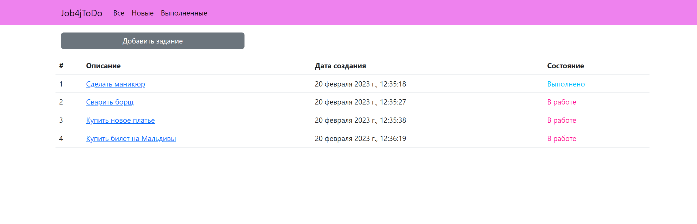
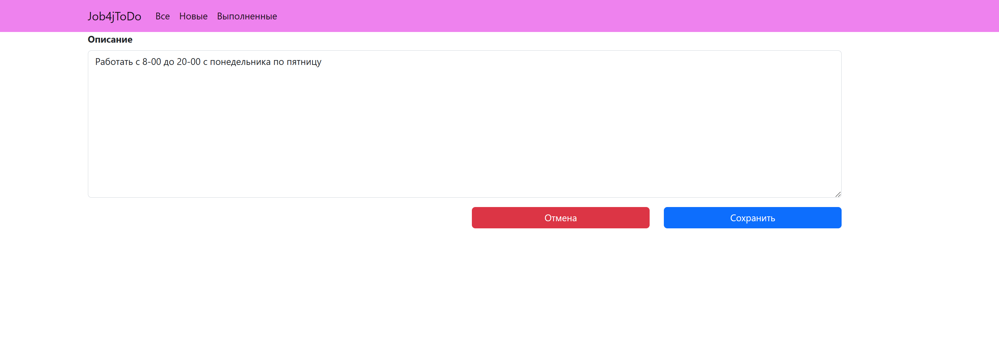
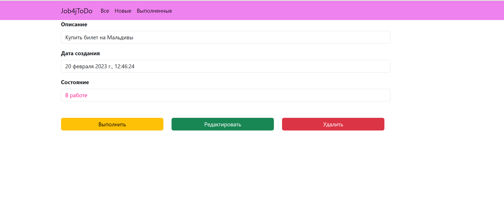
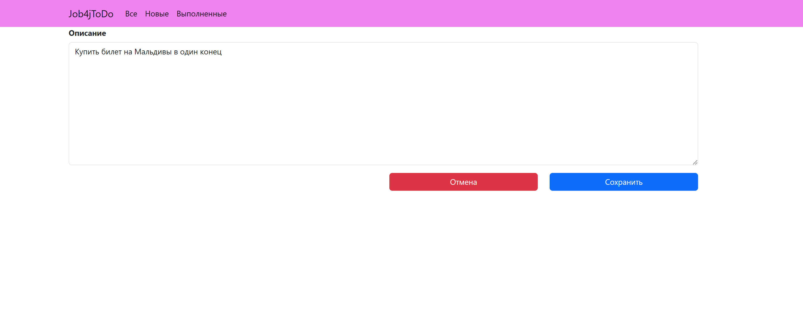
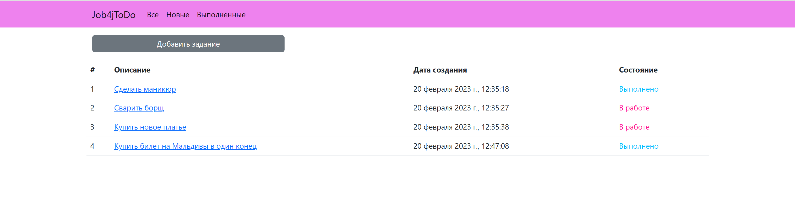
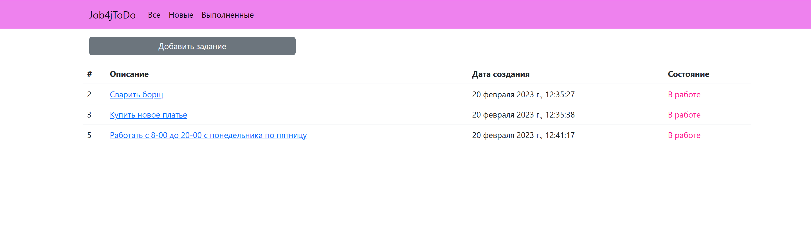
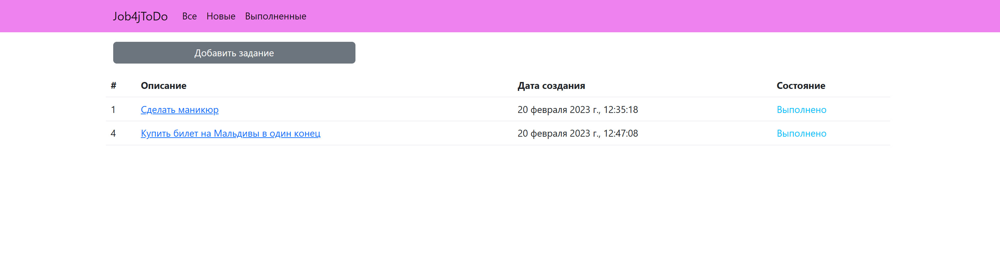
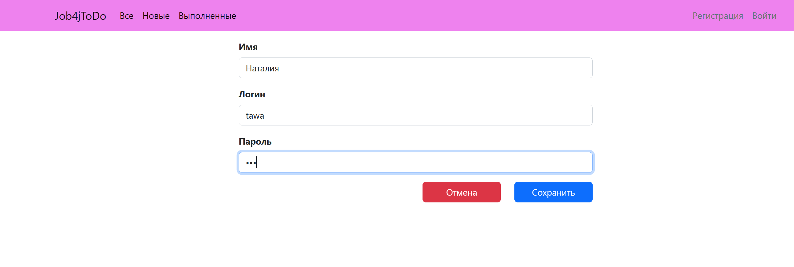
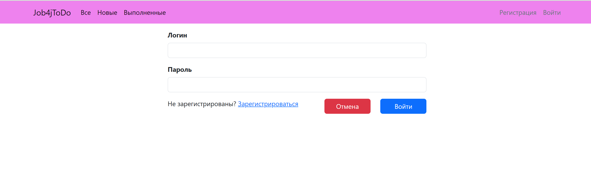
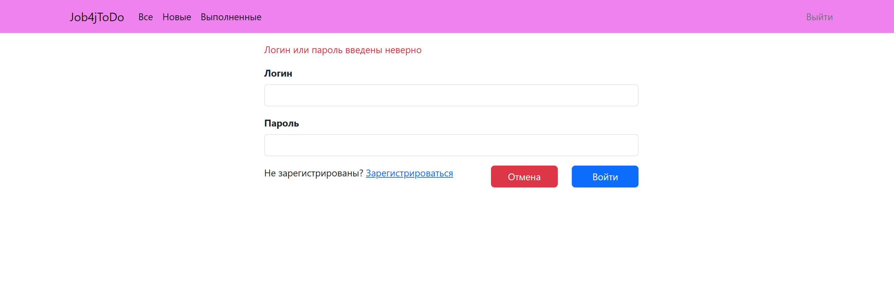

# Проект "TODO-list"

## Описание проекта.

Проект представляет собой web-приложение по созданию списка дел. В список можно добавлять задания, а также
просматривать, редактировать и удалять его. По завершению задания, есть возможно поменять его статус на "выполнено".

## Стек технологий.

- **Java 17**
- **Spring Boot 2.7.6**
- **Lombok 1.18.22**
- **Hibernate 5.6.11**
- **PostgreSQL 14**
- **Liquibase 4.15.0**
- **HTML 5**
- **Thymeleaf 2.7.6**
- **BOOTSTRAP 4.4.1**

## Требования к окружению.

- **Java 17**
- **Maven 3.8**
- **PostgresSQL 14**

## Запуск проекта.

- **Создать БД**

``` shell 
create database todo;
```

- **Запустить проект по команде**

``` shell 
mvn spring-boot:run
```

## Взаимодействие с приложением.

На главной странице представлен список заданий с указанием статуса его выполнения, также можно добавить новое задание.


На странице с добавлением задания необходимо внести описание, текущие время и статус "в работе" будет присвоены
автоматически.


Чтобы получить подробную информацию о текущем задании, необходимо перейти по его ссылке. На странице задания можно
просматривать, выполнить, редактировать или удалить его.


Для внесения изменений в задание необходимо нажать на кнопку "Редактировать".


После завершения задания необходимо нажать на кнопку "Выполнить". Его статус будет изменен на "выполнено".
После удаления задания, оно исчезает из списка дел.


Чтобы получить только новые задания, необходимо перейти по соответствующей ссылке на навигационной панели.


Чтобы получить только выполненные задания, необходимо перейти по соответствующей ссылке на навигационной панели.


Список заданий доступен только зарегистрированным пользователям. Форма регистрации.


Форма авторизации.


Если пользователь ввел неверные данные, то выйдет сообщение об ошибке.


## Контакты.

- nataliya-mar@mail.ru
- <a href="https://t.me/khmnatalia/" target="_blank">Телеграм</a></h1>
